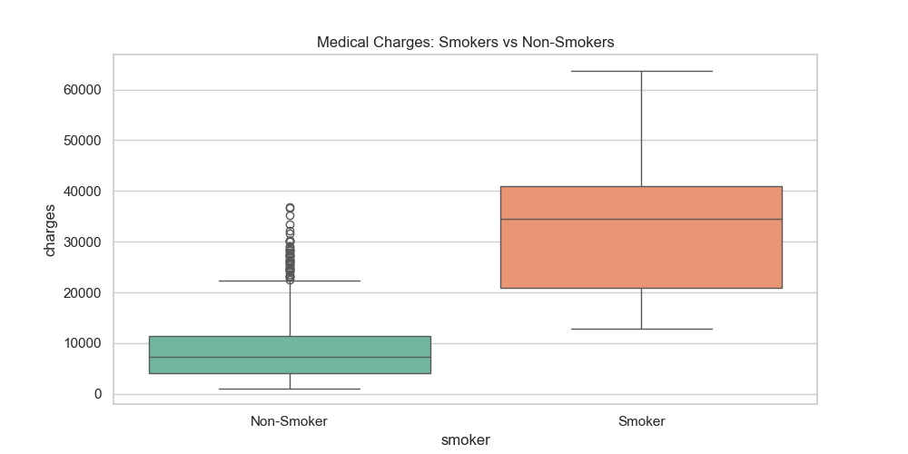
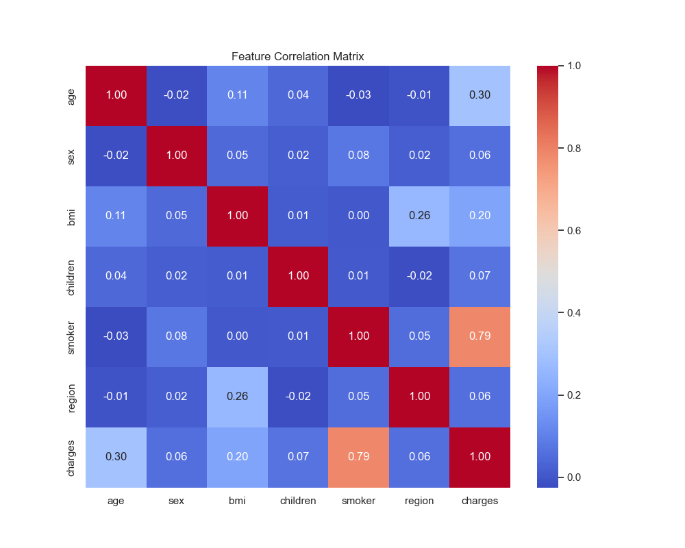
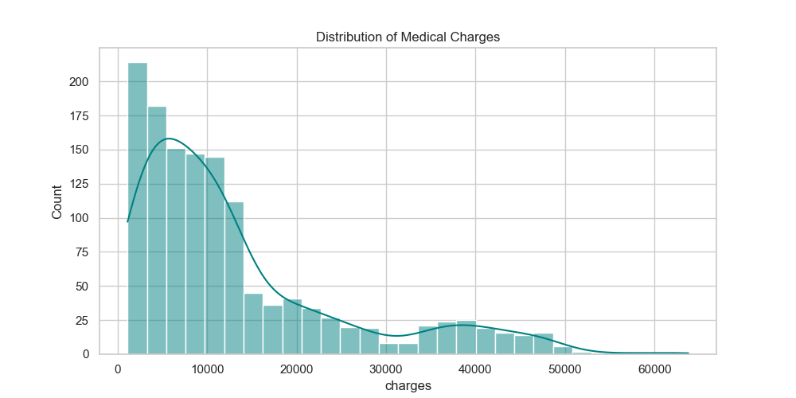

# 🏥 Medical Insurance Cost Prediction

This project uses Machine Learning to predict medical insurance costs. By analyzing patient data, we built a regression model that identifies the primary drivers of healthcare expenses.

## 🔍 Exploratory Data Analysis (EDA)

During the EDA phase, we identified three critical insights:

### 1. The Smoking Premium
Smoking status is the most significant predictor of high medical costs. Smokers consistently face charges that are 3-4x higher than non-smokers.

### 2. Correlation Analysis
The heatmap confirms a strong positive correlation (+0.79) between smoking and charges, followed by age and BMI.

### 3. Distribution of Charges
Most insurance claims are under $15,000, but there is a "long tail" of high-cost patients reaching up to $60,000.

---

## 🤖 Model Performance

We compared three different regression approaches. The **Multi-Variable Linear Regression** model, which combines smoking status, BMI, and age, provided the best balance of simplicity and accuracy.

| Model | R² Score | RMSE ($) |
| :--- | :--- | :--- |
| **Linear (Multi-Variable)** | **0.8050** | **5,986.78** |
| Ridge Regression | 0.8048 | 5,989.49 |
| Linear (Single-Smoker) | 0.6733 | 7,748.50 |

## 🛠️ How to Run
1. Ensure `Medical_insurance.csv` is in the project root.
2. Run `python insurance_analysis.py`.
3. The script will generate the EDA plots and print the model summary.

---
